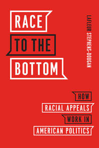

<!-- Text column -->

September 10, 2025

Listen to my latest podcast with the New Books Network

Most Americans support progressive taxation in principle, and want the rich to pay more. 
But the specific tax policies that most favor are more regressive than progressive. 
What is behind such a disconnect? 
In <a href="https://bookshop.org/a/12343/9780691137865"
target="_blank" rel="noopener"
class="font-semibold hover:underline">
Taxation and Resentment: Race, Party, and Class in American Tax Attitudes
</a> (Princeton UP, 2025), 
Andrea Louise Campbell examines public opinion on taxation, exploring why what Americans favor in principle 
differs from what they accept in practice.

Campbell shows that since the federal income tax began a century ago, 
the rich have fought for lower taxes through reduced rates and a complicated system of tax breaks. 
The resulting complexity leaves the public confused about who benefits from the convoluted tax code, 
and leads to tax preferences that are driven by factors other than principles or interests.

<a href="https://newbooksnetwork.com/taxation-and-resentment"
target="_blank" rel="noopener"
class="inline-block mt-4 btn btn-primary">
Listen now
</a>

<!-- Cover column -->

  

    Previous episodes
  

  

  <!-- Start podcast chunk -->
  

    <a href="https://newbooksnetwork.com/developing-scholars" target="_blank" rel="noopener">
      

      
      

    </a>
    <h3 class="mt-4 text-base font-semibold leading-snug">Developing Scholars</h3>
    

      Interview with Domingo Morel (19 Nov 2024)
    

    <a
      href="https://newbooksnetwork.com/developing-scholars"
      target="_blank"
      rel="noopener"
      class="btn btn-primary mt-3"
    >
      Listen here
    </a>
  

  <!-- Start podcast chunk -->
  

    <a href="https://newbooksnetwork.com/the-political-development-of-american-debt-relief-2" target="_blank" rel="noopener">
      

      
      

    </a>
    <h3 class="mt-4 text-base font-semibold leading-snug">
      The Political Development of American Debt Relief
    </h3>
    

      Interview with Thurston &amp; Zackin (25 Jun 2024)
    

    <a
      href="https://newbooksnetwork.com/the-political-development-of-american-debt-relief-2"
      target="_blank"
      rel="noopener"
      class="btn btn-primary mt-3"
    >
      Listen here
    </a>
  

  
  <!-- End podcast chunk -->

  <!-- Start podcast chunk -->
  

    <a href="https://newbooksnetwork.com/americas-new-racial-battle-lines" target="_blank" rel="noopener">
      

      
      

    </a>
    <h3 class="mt-4 text-base font-semibold leading-snug">
      America's New Racial Battle Lines
    </h3>
    

      Interview with Smith &amp; King (21 Apr 2024)
    

    <a
      href="https://newbooksnetwork.com/americas-new-racial-battle-lines"
      target="_blank"
      rel="noopener"
      class="btn btn-primary mt-3"
    >
      Listen here
    </a>
  

  
  <!-- End podcast chunk -->

  
  <!-- Start podcast chunk -->
  

    <a href="https://newbooksnetwork.com/when-bad-things-happen-to-privileged-people" target="_blank" rel="noopener">
      

      
      

    </a>
    <h3 class="mt-4 text-base font-semibold leading-snug">
      When Bad Things Happen to Privileged People
    </h3>
    

      An interview with author Dara Z. Strolovitch (October 31, 2023)
    

    <a
      href="https://newbooksnetwork.com/when-bad-things-happen-to-privileged-people"
      target="_blank"
      rel="noopener"
      class="btn btn-primary mt-3"
    >
      Listen here
    </a>
  

  <!-- End podcast chunk -->

  <!-- Start podcast chunk -->
  

    <a href="https://newbooksnetwork.com/the-advantage-of-disadvantage" target="_blank" rel="noopener">
      

      
      

    </a>
    <h3 class="mt-4 text-base font-semibold leading-snug">
      The Advantage of Disadvantage
    </h3>
    

      An interview with author LaGina Gause (May 6, 2022)
    

    <a
      href="https://newbooksnetwork.com/the-advantage-of-disadvantage"
      target="_blank"
      rel="noopener"
      class="btn btn-primary mt-3"
    >
      Listen here
    </a>
  

  <!-- End podcast chunk -->

  <!-- Start podcast chunk -->
  

    <a href="https://newbooksnetwork.com/movements-and-parties" target="_blank" rel="noopener">
      

      
      

    </a>
    <h3 class="mt-4 text-base font-semibold leading-snug">
      Movements and Parties
    </h3>
    

      An interview with author Sidney G. Tarrow (April 25, 2022)
    

    <a
      href="https://newbooksnetwork.com/movements-and-parties"
      target="_blank"
      rel="noopener"
      class="btn btn-primary mt-3"
    >
      Listen here
    </a>
  

  <!-- End podcast chunk -->
  
  <!-- Start podcast chunk -->
  

    <a href="https://newbooksnetwork.com/why-bad-policies-spread-and-good-ones-dont" target="_blank" rel="noopener">
      

      
      

    </a>
    <h3 class="mt-4 text-base font-semibold leading-snug">
      Why Bad Policies Spread (And Good Ones Don't)
    </h3>
    

      An interview with author Craig Volden (February 21, 2022)
    

    <a
      href="https://newbooksnetwork.com/why-bad-policies-spread-and-good-ones-dont"
      target="_blank"
      rel="noopener"
      class="btn btn-primary mt-3"
    >
      Listen here
    </a>
  

  <!-- End podcast chunk -->

  <!-- Start podcast chunk -->
  

    <a href="https://newbooksnetwork.com/the-judicial-tug-of-war" target="_blank" rel="noopener">
      

      
      

    </a>
    <h3 class="mt-4 text-base font-semibold leading-snug">
      The Judicial Tug of War
    </h3>
    

      An interview with authors Maya Sen and Adam Bonica (November 17, 2021)
    

    <a
      href="https://newbooksnetwork.com/the-judicial-tug-of-war"
      target="_blank"
      rel="noopener"
      class="btn btn-primary mt-3"
    >
      Listen here
    </a>
  

  <!-- End podcast chunk -->

  <!-- Start podcast chunk -->
  

    <a href="https://newbooksnetwork.com/the-limits-of-party" target="_blank" rel="noopener">
      

      
      

    </a>
    <h3 class="mt-4 text-base font-semibold leading-snug">
      The Limits of Party
    </h3>
    

      An interview with authors Frances E. Lee and James M. Curry (October 6, 2021)
    

    <a
      href="https://newbooksnetwork.com/the-limits-of-party"
      target="_blank"
      rel="noopener"
      class="btn btn-primary mt-3"
    >
      Listen here
    </a>
  

  <!-- End podcast chunk -->

  <!-- Start podcast chunk -->
  

    <a href="https://newbooksnetwork.com/race-to-the-bottom" target="_blank" rel="noopener">
      

      
      

    </a>
    <h3 class="mt-4 text-base font-semibold leading-snug">
      Race to the Bottom
    </h3>
    

      An interview with author LaFleur Stephens-Dougan (August 23, 2021)
    

    <a
      href="https://newbooksnetwork.com/race-to-the-bottom"
      target="_blank"
      rel="noopener"
      class="btn btn-primary mt-3"
    >
      Listen here
    </a>
  

  <!-- End podcast chunk -->

  <!-- Start podcast chunk -->
  

    <a href="https://newbooksnetwork.com/secular-surge" target="_blank" rel="noopener">
      

      
      

    </a>
    <h3 class="mt-4 text-base font-semibold leading-snug">
      Secular Surge
    </h3>
    

      An interview with authors David E. Campbell and Geoffrey C. Layman (August 18, 2021)
    

    <a
      href="https://newbooksnetwork.com/secular-surge"
      target="_blank"
      rel="noopener"
      class="btn btn-primary mt-3"
    >
      Listen here
    </a>
  

  <!-- End podcast chunk -->  

